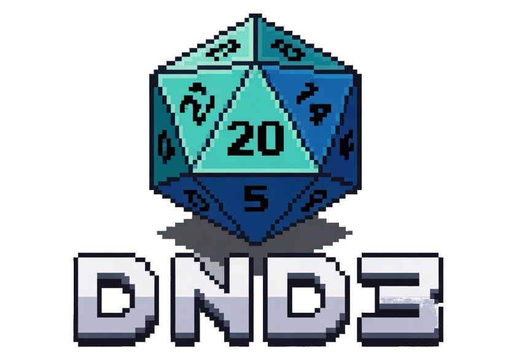

    
    <h1>dnd3</h1>
    
<strong>A modular 3D pixel-art voxel Virtual Tabletop for Dungeons & Dragons 3.5e and other tabletop RPG systems</strong>

    
    

 

**dnd3** is a hard fork of [dnd3](https://www.dnd3.org/) (formerly dnd3) transformed into a full-featured, immersive 3D voxel Virtual Tabletop with crisp retro pixel-art rendering.

### Origins

dnd3 started as a fork of dnd3 but has significantly diverged to become a dedicated VTT. It includes:
- Custom 3D pixel-art rendering pipeline
- Modular ruleset system (D&D 3.5e is the default)
- Full GM toolkit, character sheets, animated avatars, sound painting, weather, day/night cycles, and more

**Important**: dnd3 is **not compatible** with upstream dnd3 releases.

---

## Features

- Beautiful crisp **3D pixel-art** voxel world (configurable retro pipeline)
- Animated 3D avatars & monsters (glTF support)
- Complete D&D 3.5e ruleset with character sheets, inventory, spells, and combat automation
- Modular ruleset system — easily add Pathfinder, D&D 5e, OSR, or custom systems
- Advanced GM tools: fog of war, dynamic lighting, initiative, prefabs, loot tables
- Sound painting, GM music/SFX streaming, day/night cycle, dynamic weather
- Multiplayer with clear GM/Player roles
- Persistent sessions and worlds

---

## Table of Contents

1. [Quick Start](#quick-start)
2. [Default Controls](#default-controls)
3. [Paths](#paths)
4. [Configuration File](#configuration-file)
5. [Command-line Options](#command-line-options)
6. [Compiling](#compiling)
7. [Origins & Credits](#origins--credits)

---

## Quick Start

1. Download the latest release
2. Run `dnd3` (or `dnd3server` for dedicated server)
3. Create a new world → it will load the default `dnd3` game with the `dnd35` ruleset
4. Host or join a session and start playing!

**For GMs**: Use the GM toolbox (accessible via the pause menu or `/gm` commands).

---

## Default Controls

Most controls are re-bindable. Core VTT-relevant bindings:

| Button                        | Action                                      |
|-------------------------------|---------------------------------------------|
| Move mouse                    | Look around                                 |
| W, A, S, D                    | Move                                        |
| Space                         | Jump / Move up                              |
| Shift                         | Sneak / Move down                           |
| Left mouse                    | Interact / Attack                           |
| Right mouse                   | Use / Place                                 |
| I                             | Character sheet / Inventory                 |
| T                             | Chat                                        |
| /                             | Command (try `/help`)                       |
| C                             | Cycle camera modes (top-down, isometric, 3rd person) |
| F1                            | Toggle HUD                                  |
| F5                            | Debug info                                  |

Full list available in-game under **Settings → Controls**.

---

## Paths

* `bin`   - Compiled binaries (`dnd3`, `dnd3server`)
* `share` - Read-only game data
* `user`  - User data (worlds, mods, settings)

**User directory locations**:
- Windows: `%APPDATA%\dnd3`
- Linux: `~/.dnd3`
- macOS: `~/Library/Application Support/dnd3`

Worlds & sessions are stored in `user/worlds/` and `user/sessions/`.

---

## Configuration File

- Default: `user/dnd3.conf`
- Created automatically on first run
- Command line: `--config <path>`

---

## Command-line Options

Run `dnd3 --help` for full list.

---

## Compiling

See `doc/compiling/` for platform-specific guides (Linux, Windows, macOS).

---

## Origins & Credits

dnd3 is a **hard fork** of [dnd3](https://www.dnd3.org/) (formerly dnd3). We are extremely grateful to Perttu Ahola (celeron55) and the entire dnd3/dnd3 community for building such a powerful open-source voxel engine.

**Original Copyright**:
Copyright (C) 2010-2026 Perttu Ahola <celeron55@gmail.com> and contributors.

dnd3 is licensed under the same **LGPLv2.1+** license.

---

**Happy Tabletop Adventuring!** 🎲
